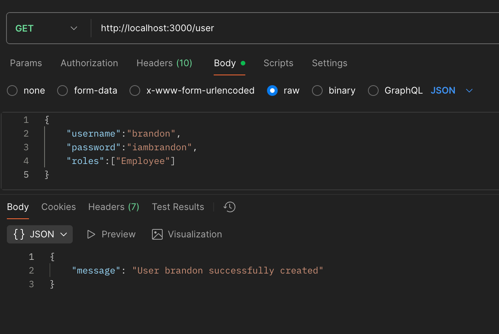
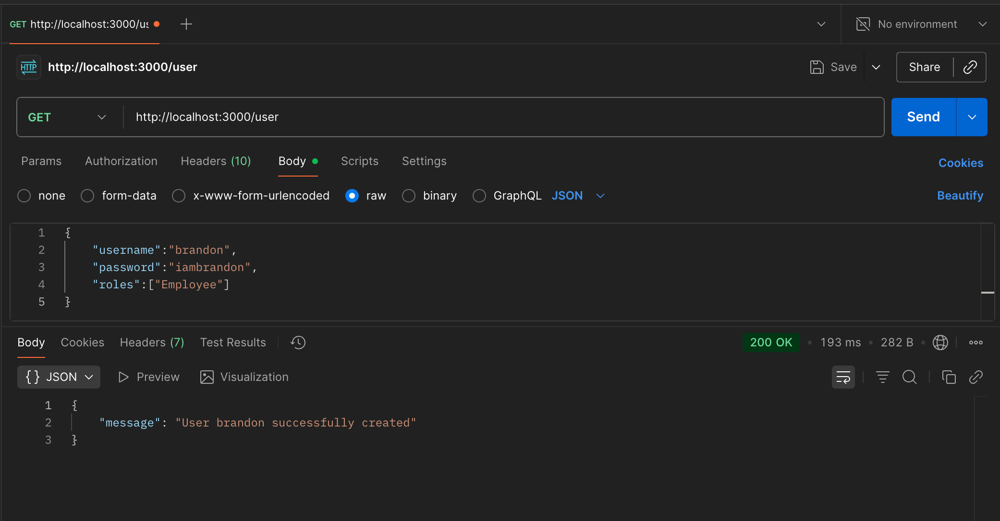

## TechNotes

TechNotes provides end-to-end ticket management system with user authentication, built-in middleware, written in a scabale fashion.

# 🚀 Features

- User authentication
- Built-in logger
- Admin can get, delete, create and update user(s)
- Interactive UI
- Notes can be assigned, reassigned and completed

# 📷 Screenshots

# 🛠️ Installation
Prerequisites

Node.js >= 18

npm or yarn

Steps
- Clone the repository
git clone <this repository's link>

- Navigate into the folder
cd techNotes

- Install dependencies
npm install

- Start the development server
npm run dev

# ⚡ Contact me 

sakshamsahore@gmail.com