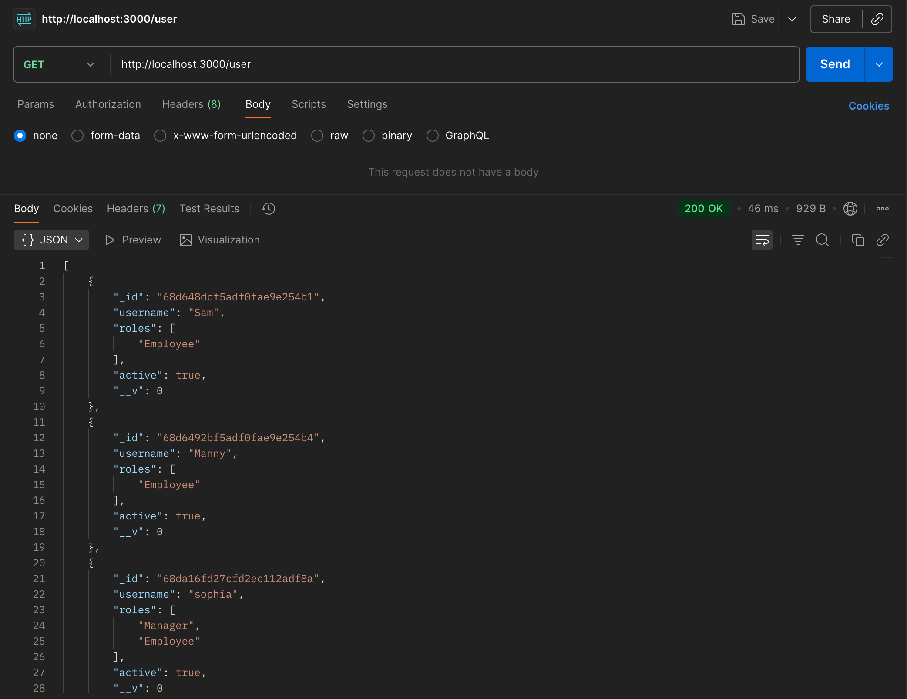
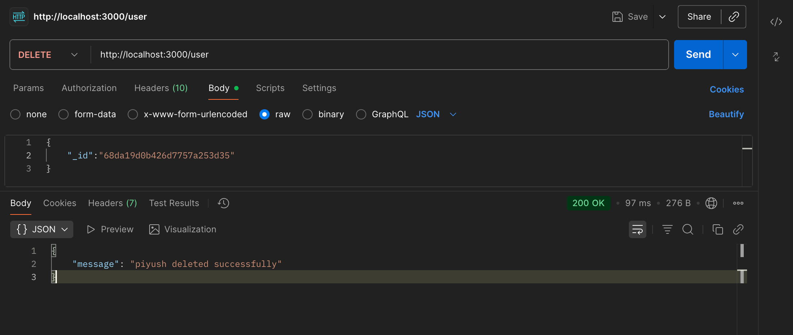
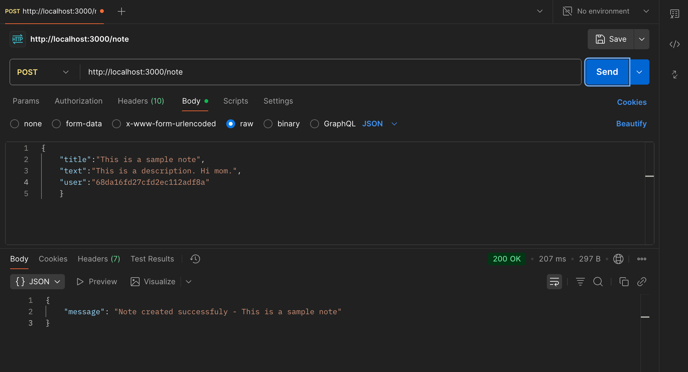
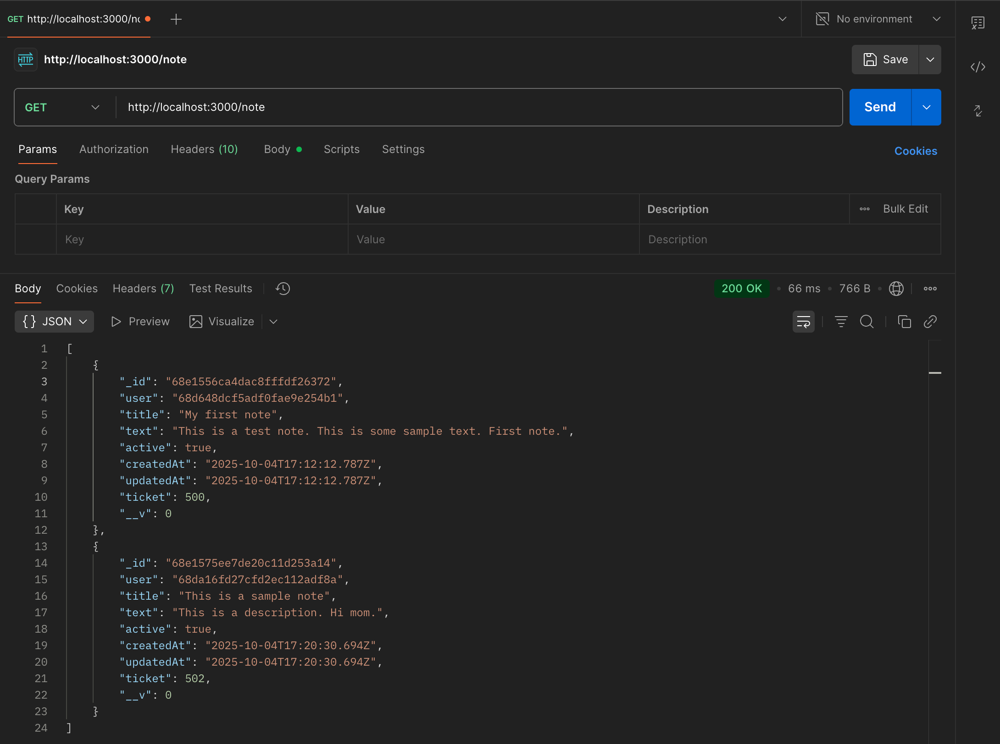
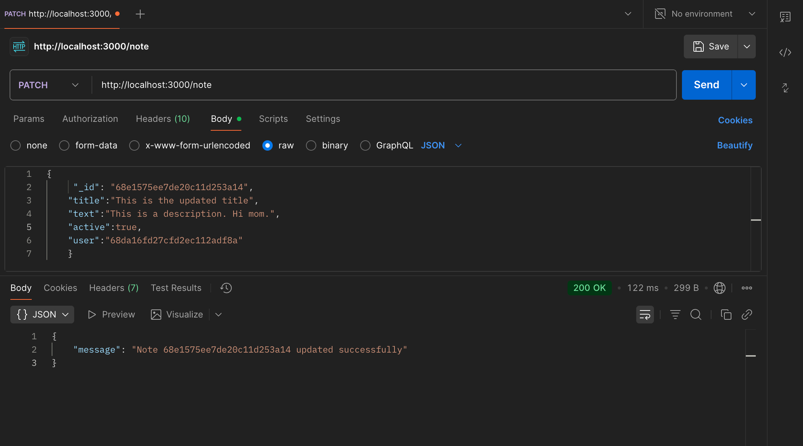
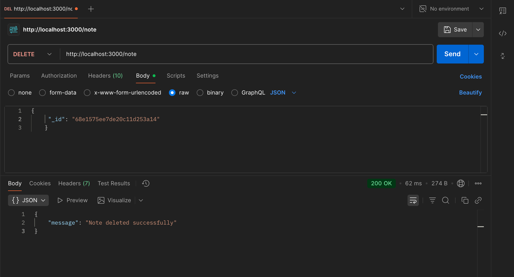

## TechNotes

TechNotes provides end-to-end ticket management system with user authentication, built-in middleware, written in a scabale fashion.

# 🚀 Features

- User authentication and authorisation
- Each note is assigned to a user
- Users and notes can be amended, created, deleted and accessed (CRUD)
- Built-in logger that logs all requests internally and in console
- Access given based on roles of employees
- Sleek and Fully functional, user-first UI
- Notes can be assigned, reassigned and completed

# 📷 Screenshots
Users

Notes

# 🛠️ Installation
Prerequisites

Node.js >= 18

npm or yarn

Steps
- Clone the repository
git clone <this repository's link>

- Navigate into the folder
cd techNotes

- Install dependencies
npm install

- Start the development server
npm run dev

# ⚡ Contact me 

sakshamsahore@gmail.com